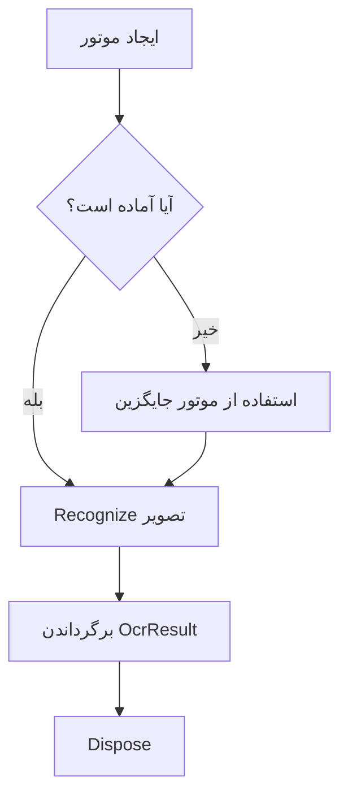

# معماری موتورهای OCR

این پوشه شامل پیاده‌سازی‌های مختلف موتورهای OCR برای تشخیص نوشته‌های پلاک است.

## 📐 معماری

همه موتورهای OCR از یک رابط مشترک (`IOcrEngine`) پیروی می‌کنند که امکان جایگزینی و توسعه آسان را فراهم می‌کند.

```
┌─────────────────────────────────────┐
│      PlateOcrService                │
│  (مدیریت و انتخاب موتور)            │
└──────────────┬──────────────────────┘
               │
               │ استفاده از
               ▼
      ┌────────────────┐
      │   IOcrEngine   │  ◄─── Interface مشترک
      └────────┬───────┘
               │
      ┌────────┴────────┬──────────────┐
      │                 │              │
      ▼                 ▼              ▼
┌──────────┐    ┌──────────┐   ┌──────────┐
│  Simple  │    │   YOLO   │   │  IronOCR │
│  OCR     │    │   OCR    │   │          │
└──────────┘    └──────────┘   └──────────┘
```

## 🔌 Interface: IOcrEngine

تمام موتورهای OCR باید این رابط را پیاده‌سازی کنند:

```csharp
public interface IOcrEngine : IDisposable
{
    // تشخیص متن از تصویر
    OcrResult Recognize(Bitmap plateImage);

    // نام موتور
    string EngineName { get; }

    // روش OCR
    OcrMethod Method { get; }

    // وضعیت آمادگی
    bool IsReady { get; }
}
```

## 🛠️ موتورهای پیاده‌سازی شده

### 1. SimpleOcrEngine

**فایل:** `SimpleOcrEngine.cs`

**ویژگی‌ها:**

- استفاده از الگوریتم‌های پایه OpenCV
- بدون نیاز به مدل خارجی
- سبک و سریع
- مناسب برای تست و محیط‌های با منابع محدود

**پیاده‌سازی:**

```csharp
var engine = new SimpleOcrEngine();
var result = engine.Recognize(plateImage);
```

**فرآیند پردازش:**

1. تبدیل به Grayscale
2. Histogram Equalization (افزایش کنتراست)
3. Otsu Thresholding
4. تشخیص کانتورها
5. استخراج متن

**بهبودهای آینده:**

- [ ] Template Matching برای تشخیص حروف
- [ ] Feature Extraction (HOG, SIFT)
- [ ] شبکه عصبی ساده (CNN)

---

### 2. YoloOcrEngine

**فایل:** `YoloOcrEngine.cs`

**ویژگی‌ها:**

- استفاده از مدل YOLO برای تشخیص حروف
- دقت بالا
- نیاز به مدل ONNX آموزش دیده
- پشتیبانی از GPU

**پیاده‌سازی:**

```csharp
var engine = new YoloOcrEngine("models/plate-ocr.onnx", confidenceThreshold: 0.5f);

if (engine.IsReady)
{
    var result = engine.Recognize(plateImage);
}
```

**فرآیند پردازش:**

1. پیش‌پردازش تصویر (Resize به 640x640)
2. تبدیل به Tensor
3. اجرای مدل YOLO
4. Post-processing (NMS, فیلتر با confidence)
5. مرتب‌سازی حروف بر اساس موقعیت
6. ترکیب به متن پلاک

**وابستگی‌ها:**

- مدل ONNX آموزش دیده
- Microsoft.ML.OnnxRuntime (موجود در پروژه)

**TODO:**

- [ ] پیاده‌سازی کامل ONNX Runtime inference
- [ ] پیاده‌سازی NMS
- [ ] بهینه‌سازی پیش‌پردازش

---

### 3. IronOcrEngine

**فایل:** `IronOcrEngine.cs`

**ویژگی‌ها:**

- استفاده از کتابخانه IronOCR (Tesseract)
- پشتیبانی از زبان‌های مختلف
- دقت بالا برای متون فارسی
- قابل تنظیم

**پیاده‌سازی:**

```csharp
var engine = new IronOcrEngine();

if (engine.IsReady)
{
    var result = engine.Recognize(plateImage);
}
```

**تنظیمات:**

```csharp
engine.SetLanguage("Persian");
engine.SetWhitelistCharacters("0123456789ابپتثجدذرزسشصطظعفقکگلمنوهی");
```

**وابستگی‌ها:**

- پکیج IronOcr (نیاز به نصب دستی)

```bash
dotnet add package IronOcr
```

**TODO:**

- [ ] نصب پکیج IronOcr
- [ ] تنظیم زبان فارسی
- [ ] بهینه‌سازی پارامترها

---

## 🔄 چرخه حیات موتور OCR



## 📊 مقایسه موتورها

| ویژگی            | Simple         | YOLO              | IronOCR            |
| ---------------- | -------------- | ----------------- | ------------------ |
| **دقت**          | متوسط (60-70%) | بالا (85-95%)     | بالا (80-90%)      |
| **سرعت**         | سریع (10-30ms) | متوسط (50-100ms)  | کند (100-300ms)    |
| **حافظه**        | کم (< 50MB)    | متوسط (200-500MB) | زیاد (500MB+)      |
| **مدل خارجی**    | ❌ خیر         | ✅ بله (ONNX)     | ✅ بله (Tesseract) |
| **GPU**          | ❌ خیر         | ✅ بله            | ❌ خیر             |
| **پیچیدگی کد**   | ساده           | متوسط             | ساده               |
| **هزینه لایسنس** | رایگان         | رایگان            | تجاری\*            |

\*IronOCR برای استفاده تجاری نیاز به لایسنس دارد.

## 🚀 افزودن موتور جدید

برای افزودن یک موتور OCR جدید:

### 1. ایجاد کلاس جدید

```csharp
public class MyCustomOcrEngine : IOcrEngine
{
    public string EngineName => "My Custom OCR";
    public OcrMethod Method => OcrMethod.Custom; // نیاز به افزودن در Enum
    public bool IsReady { get; private set; }

    public MyCustomOcrEngine()
    {
        // مقداردهی
        IsReady = true;
    }

    public OcrResult Recognize(Bitmap plateImage)
    {
        // پیاده‌سازی تشخیص
        return new OcrResult
        {
            Text = "...",
            Confidence = 0.9f,
            IsSuccessful = true,
            Method = Method
        };
    }

    public void Dispose()
    {
        // پاکسازی منابع
    }
}
```

### 2. افزودن به Enum

در `OcrMethod.cs`:

```csharp
public enum OcrMethod
{
    Simple = 0,
    Yolo = 1,
    IronOcr = 2,
    Custom = 3  // ← جدید
}
```

### 3. افزودن به PlateOcrService

در `PlateOcrService.cs`:

```csharp
private IOcrEngine CreateOcrEngine(OcrMethod method)
{
    switch (method)
    {
        case OcrMethod.Custom:
            return new MyCustomOcrEngine();
        // ... بقیه موارد
    }
}
```

## 🧪 تست موتورها

```csharp
// تست همه موتورها
var methods = new[] { OcrMethod.Simple, OcrMethod.Yolo, OcrMethod.IronOcr };

foreach (var method in methods)
{
    var config = new NodeConfiguration { OcrMethod = method };
    using var service = new PlateOcrService(config);

    var result = service.RecognizePlate(plateImage);
    Console.WriteLine($"{method}: {result.Text} ({result.Confidence:P0})");
}
```

## 📝 بهترین شیوه‌ها

### 1. مدیریت منابع

```csharp
// همیشه از using استفاده کنید
using var engine = new YoloOcrEngine("model.onnx");
var result = engine.Recognize(image);
```

### 2. بررسی آمادگی

```csharp
if (!engine.IsReady)
{
    // استفاده از موتور جایگزین یا پرتاب خطا
    throw new InvalidOperationException("Engine not ready");
}
```

### 3. مدیریت خطا

```csharp
try
{
    var result = engine.Recognize(image);
    if (!result.IsSuccessful)
    {
        Console.WriteLine($"خطا: {result.ErrorMessage}");
    }
}
catch (Exception ex)
{
    // مدیریت خطا
}
```

## 🔧 پارامترهای بهینه

### SimpleOcrEngine

- Gaussian Blur: kernel_size = 3
- Canny Thresholds: 30-100
- Min Contour Area: 50 pixels

### YoloOcrEngine

- Input Size: 640x640
- Confidence Threshold: 0.5
- NMS IoU Threshold: 0.45

### IronOcrEngine

- Language: Persian
- Page Segmentation: Auto
- Engine Mode: LSTM Only

## 📚 منابع

- [OpenCV Documentation](https://docs.opencv.org/)
- [YOLO Official Docs](https://docs.ultralytics.com/)
- [IronOCR Documentation](https://ironsoftware.com/csharp/ocr/)
- [ONNX Runtime](https://onnxruntime.ai/)

## 🤝 مشارکت

برای بهبود موتورهای OCR:

1. Fork کنید
2. یک branch جدید بسازید
3. تغییرات خود را commit کنید
4. Pull Request بفرستید

---

**آخرین بروزرسانی:** اکتبر 2025  
**نسخه:** 1.0.0
